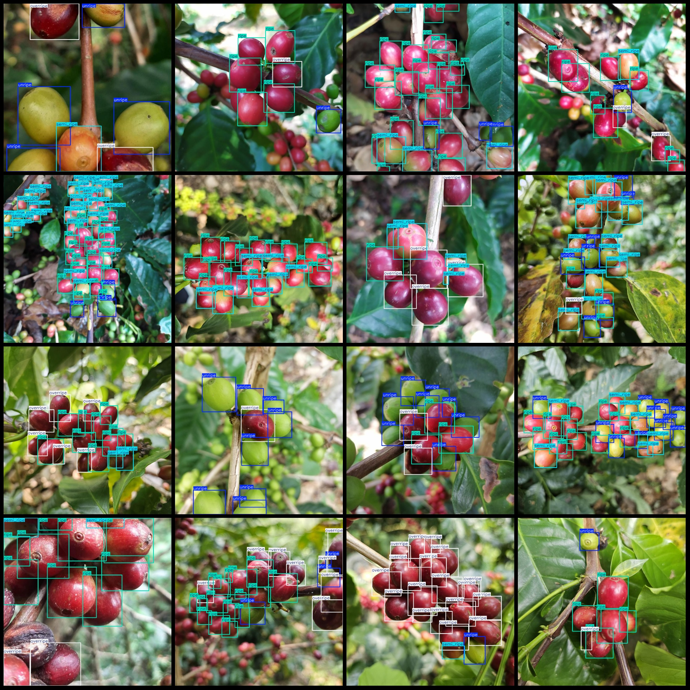
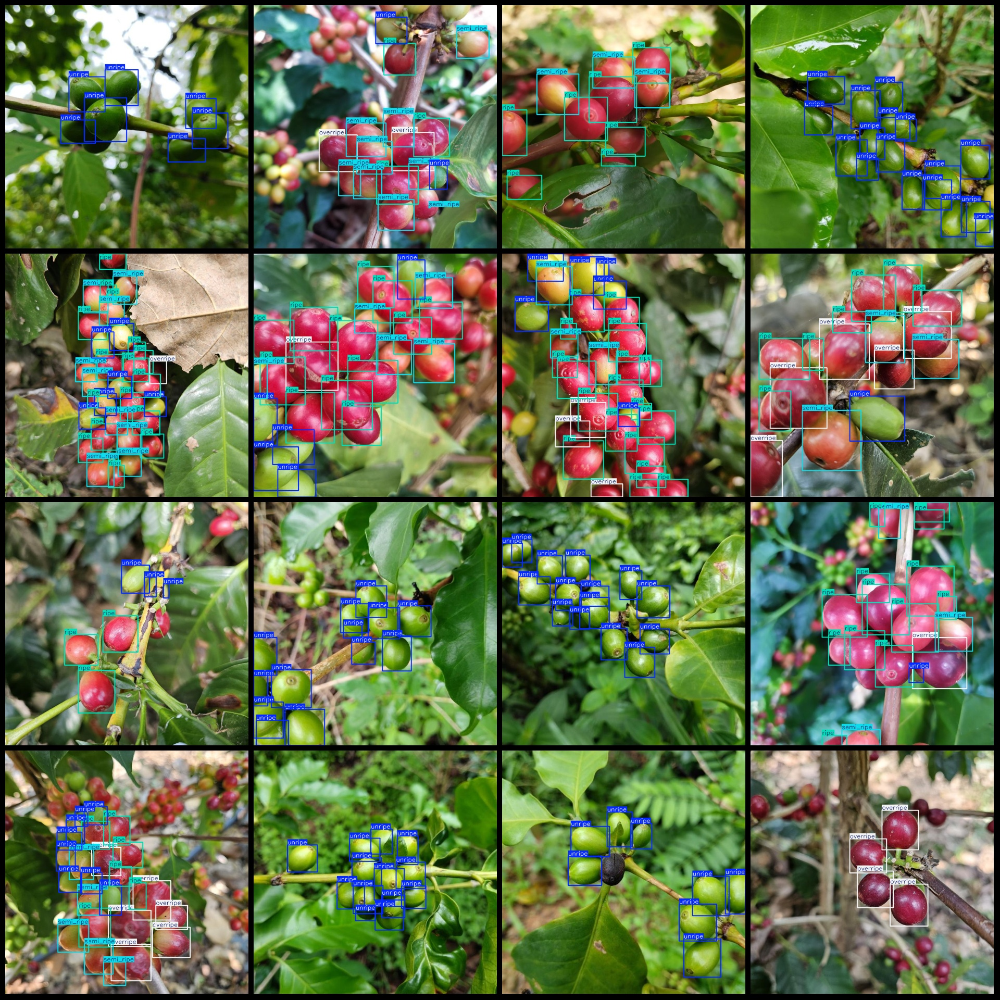

# Coffee Fruit Maturity Detection Dataset VOC+YOLO format with 2045 images for 4 categories

Dataset format: Pascal VOC format + YOLO format (txt file without split path, only containing jpg images and corresponding VOC format xml files and yolo format txt files)

Number of image files (jpg files): 2045
Number of annotations (xml files): 2045
Number of annotations (txt files): 2045
Number of annotation categories: 4
Annotation category names (note that the order of categories in the yolo format does not correspond with this, but is based on the labels folder classes.txt): ["overripe", "ripe", "semi_ripe", 
"unripe"]

Each category has a number of bounding box frames:
- Overripe (overcooked): 4791
- Ripe (ripe): 13275
- Semi-ripe (half cooked): 6391
- Unripe (undercooked): 12851
Total bounding box frames: 37308

Each category occupies a number of images:
- Overripe (overcooked): 1030
- Ripe (ripe): 1448
- Semi-ripe (half cooked): 1240
- Unripe (undercooked): 1624
Image resolution: 800x800

Annotation tool used: labelImg
Annotation rule: draw rectangle bounding boxes for each category

Important notice: The dataset does not have been divided into training validation test sets, so it needs to be divided by the user themselves.

Special declaration: This dataset does not guarantee any accuracy of the trained model or weight files.

Image preview:
## IMAGE

Here is a pay link on Stripe ( https://buy.stripe.com/3cs8yP7sY87d0vu9AB ). Please contact me lonlonago@foxmail.com after funding $89, and I will send you a complete data files , thank you!

